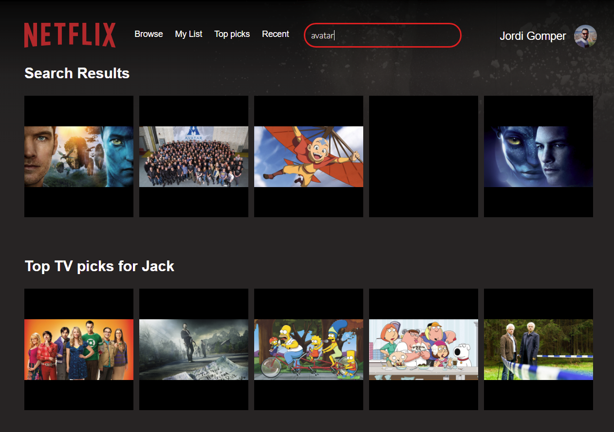

Un clone del home de netflix creado con React.js.  

Puedes encontrar un articulo de como hacerlo en mi blog -> [Articulo home NETFLIX - Jordi Gomper](https://jordigomper.github.io/myblog/articulo/2017/10/24/Home-de-netflix.html)

Puedes ver el resultado en -> [jgomper-netflix.surge.sh](https://jgomper-netflix.surge.sh)

Esta basado en el articulo de [Sophia Shoemaker y Jack Oliver](https://www.fullstackreact.com/react-daily-ui/003-landing-page/). A diferencia de la fuente, mi home de netflix está estructurado bajo ESCM6.  

## HOME:

## BUSQUEDAS:
